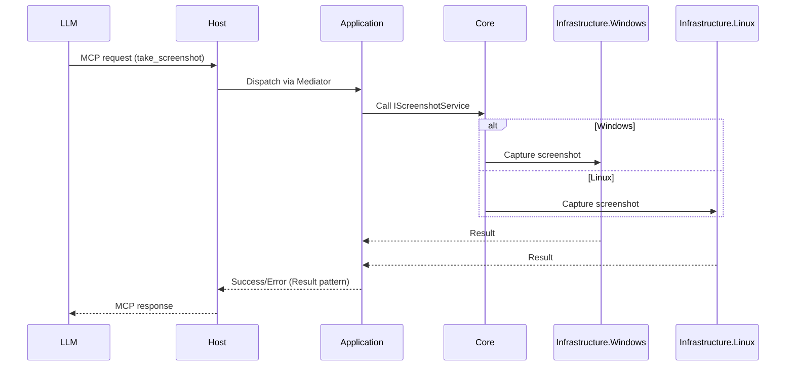

# Nexus

**Nexus** is a cross-platform **Model Context Protocol (MCP) Tool Server** designed to expose a set of automation tools that allow LLMs to interact with desktop environments such as Windows and Linux.
It provides a unified way to execute system-level operations like clicking, typing, launching applications, and scraping data—bridging the gap between natural language and desktop automation.

---

## 🚀 Features (Tools)

Nexus provides the following tools for desktop automation:

* **Click-Tool** → Click on the screen at the given coordinates.
* **Type-Tool** → Type text on an element (optionally clears existing text).
* **Clipboard-Tool** → Copy or paste using the system clipboard.
* **Scroll-Tool** → Scroll vertically or horizontally on windows or regions.
* **Drag-Tool** → Drag from one point to another.
* **Move-Tool** → Move the mouse pointer.
* **Shortcut-Tool** → Press keyboard shortcuts (e.g., `Ctrl+C`, `Alt+Tab`).
* **Key-Tool** → Press a single key.
* **Wait-Tool** → Pause for a defined duration.
* **State-Tool** → Capture a combined snapshot of:

  * Default language
  * Browser
  * Active applications
  * Interactive, textual, and scrollable elements
  * Screenshot of the desktop
* **Resize-Tool** → Change window size or reposition an application.
* **Launch-Tool** → Launch an application from the start menu.
* **Shell-Tool** → Execute PowerShell (Windows) or Bash (Linux) commands.
* **Scrape-Tool** → Scrape the entire webpage for information.

---

## 🏗 Project Structure

```bash
Nexus/
│── src/
│   ├── Nexus.Core/                # Shared domain, contracts, mediator handlers
│   ├── Nexus.Application/         # Tool orchestration, use cases
│   ├── Nexus.Infrastructure/      # Cross-platform abstractions
│   ├── Nexus.Infrastructure.Windows/ # Windows-specific implementation
│   ├── Nexus.Infrastructure.Linux/   # Linux-specific implementation (future)
│   ├── Nexus.Host/                # Console host (MCP server entrypoint)
│
│── tests/
│   ├── Nexus.UnitTests/           # Unit tests for domain & tools
│   ├── Nexus.IntegrationTests/    # Integration tests with MCP clients
│
│── README.md
```

---

## 🏛 Architecture

The following diagram illustrates how Nexus handles MCP requests and routes them through the appropriate platform-specific implementations:



---

## ⚙️ Tech Stack

* **.NET 10** (C#)
* **MediatR** → Mediator pattern for tool execution
* **FluentResults** → Result pattern for error handling & success/failure states
* **MCP Standard** → For communication with LLMs
* **Windows API / UIAutomation** → Windows desktop automation
* **(Future)** Linux support via `xdotool`, `xclip`, and native APIs

---

## 🖥 Running Nexus (Windows)

1. Clone the repository:

   ```bash
   git clone https://github.com/your-org/nexus.git
   cd nexus
   ```

2. Build the solution:

   ```bash
   dotnet build
   ```

3. Run the MCP server:

   ```bash
   cd src/Nexus.Host
   dotnet run
   ```

4. Connect your MCP-compatible LLM client (e.g., Claude Desktop, Cursor, etc.) to the Nexus server.

---

## 📦 Example Usage

Example: Taking a screenshot with `State-Tool` (Windows).

```json
{
  "tool": "State-Tool",
  "arguments": {
    "includeScreenshot": true
  }
}
```

➡️ Returns a JSON response with system state details and a base64 screenshot.

---

## 🛠 Future Roadmap

* ✅ Windows support (in progress)
* 🔲 Linux support (using `xdotool`, `wmctrl`, `xclip`, `imagemagick`)
* 🔲 macOS support (if needed)
* 🔲 More advanced scraping (DOM + OCR integration)
* 🔲 Multi-session / concurrency improvements

---

## 🤝 Contributing

Contributions are welcome! Feel free to open issues, propose tools, or improve platform-specific implementations.

---

## 📜 License

MIT License. Free to use and modify.
